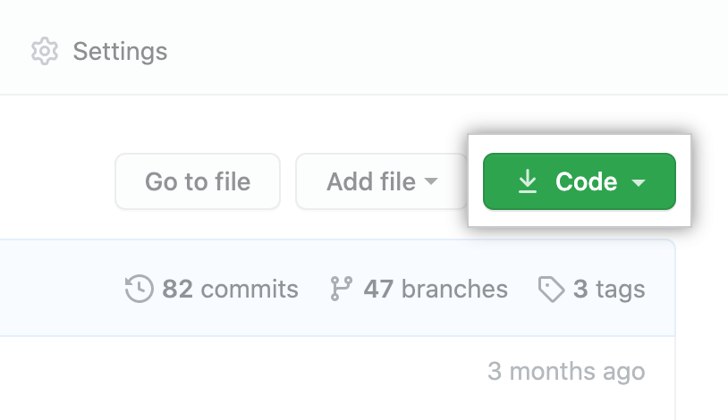

# Coding Challenge

## Description

*_ Create an app that uses http://wp8m3he1wt.s3-website-ap-southeast-2.amazonaws.com/api/products/1 API End point to Find the average cubic weight for all products in the "Air Conditioners" category. _*

# Languages
* HTML5
* Bootstrap
* Async Functions
* JavaScript
## IDE Used
* VS Code

## Walkthrough
1. Create the HTML
* Create a table for the data to be displayed.

2. Use the API's response
* Create a new function that fetches the products info from the API.
* Using template literals for the API url
fetch(`http://wp8m3he1wt.s3-website-ap-southeast-2.amazonaws.com/api/products/1`)
* Format the response into a usable format with .then(response => response.json());
* To get all the data from paginated API - concat the data 

3. Calculate Cubic Weight
Cubic Weight Example
A parcel measuring 40cm long (0.4m) x 20cm high (0.2m) x 30cm wide (0.3m) is equal to 0.024 cubic metres.
Multiplied by the conversion factor of 250 gives a cubic weight of 6kg.

0.4m x 0.2m x 0.3m = 0.024m3
0.024m3 x 250 = 6kg

4. Implement the Javascript structure(app.js)
* Target all the required elements using document.getElementById();
* create a new function const createHtml = ({}) => It will take in the parameters of the API data.
* In createHtml return the template card that was created in the html. Pass in the input value as one of the parts of your table data to make sure it works!
* You will need to return the string using template literals and the return keyword if you have not used the one line function style.
   const productHtml =  createHtml (categoryValue);
   productHtmlList.push(productHtml);
   document.getElementById('category-container').innerHTML = productHtmlList.join(' ');

# Setup cloning the repository on your local machine
* On GitHub, navigate to the main page of the repository.
* Above the list of files, click  Code.

* To clone the repository using HTTPS, under "Clone with HTTPS", click on end icon . To clone the repository using an SSH key, including a certificate issued by your organization's SSH certificate authority, click Use SSH, then click on end icon . To clone a repository using GitHub CLI, click Use GitHub CLI, then click on end icon .

